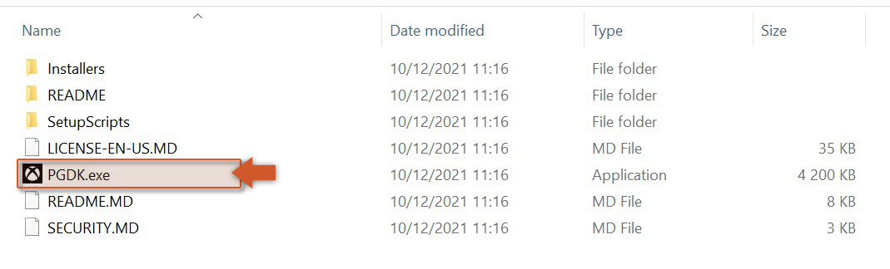
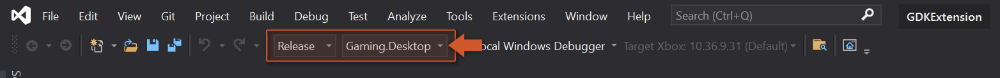

@title Building Guide (How to build the extension from source)

# Building Guide

This guide will provide you the necessary steps for building the extension from source, if you wish to do so.

1. Install Visual Studio 2022 (see [download site](https://visualstudio.microsoft.com/downloads/)).
2. Install GDK (Apr 2025) from Microsoft's GitHub repository ([here](https://github.com/microsoft/GDK/releases/tag/April-2025-v2504.0.4020)). 

3. Install CMAKE (see [download site](https://cmake.org/download/)).
4. Clone the GDK Extension repository (see [here](https://github.com/YoYoGames/GDKExtension)).
5. Open the Solution in `source/GDKExtension_gml/extensions/GDKExtension/gdkextension_windows/GDKExtension.sln` with Visual Studio 2022.
6. Select either one of these building targets: `Debug|Gaming.Desktop.x64` or `Release|Gaming.Desktop.x64` (other options won't work). 

7. Build the project; the compiled DLL will then be exported to the folder `source/GDKExtension_gml/extensions/GDKExtension/`.
8. You've now finished the building process and can continue [setting up your project](gdk_extension_guides).

  

---