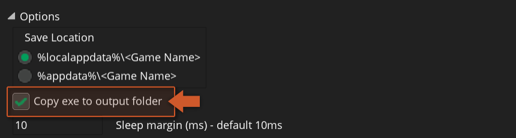
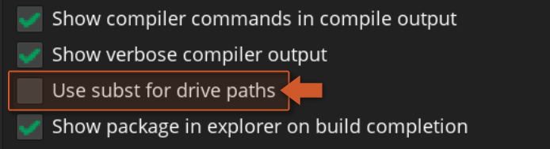

@title Quick Start Guide (Project setup, sandboxes & configuration files)

# Quick Start Guide

You will initially need to set up your project for the GDK Extension to work properly. This guide covers all aspects of your project that you will need to configure.

## Project Setup

In order to build your project using the extension you need to import it and make some changes to your project:

1. Import the local package ( **.yymps** ) provided with the public release version.
2. Make sure to enable the **"Copy exe to output folder"** setting. To enable this go into **Game Options → Windows → General** and enable **Copy exe to output folder**: <br>


> [!IMPORTANT]
> These steps are required only for older versions of GameMaker:
> 
> * **For GameMaker versions prior to 2022.8** : Make sure to use the 64-bit Windows runtime. To change this go into **Game Options → Windows → General** and enable " **Use x64 Windows Runtime** ".<br>

>
> * **For GameMaker 2022.3 (or previous)** : Also make sure you disable the subst from within the **Preferences → General Settings → Compiling** menu, otherwise this extension will not work:
>
> 
>
> * **For GameMaker 2022.2 (or previous)** : The extension comes with two **.bat** files: `post_package_step.bat` and `post_run_step.bat` (placed inside the extension's folder). These files need to be moved into your project's root folder, which is the same directory as your project's **.yyp** file:
> 
> 

After finishing this we'll set up the config file required for the Microsoft Store.

## Sandbox Get/Set

  When using Xbox Live features, you might need to change your PC sandboxes (see [official documentation](https://docs.microsoft.com/en-us/gaming/gdk/_content/gc/live/test-release/tools/live-pc-sandbox-switcher)) so you can test those same features. For this purpose, you can run the GDK Command Line (under `Start → All Apps → Microsoft GDK → Desktop VS 2022 Gaming Command Prompt`) and use one of the following commands:

* `XblPCSandbox /get` (returns the current sandbox, default is RETAIL)
* `XblPCSandbox <sandbox>` (changes the sandbox, where *`<sandbox>`* refers to your sandbox name)
* `XblPCSandbox RETAIL` (sets the sandbox back to RETAIL)

> [!NOTE]
> Sandbox names are case sensitive.

## Config File

To build and run your project using the GDK Extension, it's necessary to set up and include a `MicrosoftGame.Config` file:

1. This config file can be created using Microsoft's MicrosoftGame.config Editor tool (for more information refer to its [documentation page](https://docs.microsoft.com/en-us/gaming/gdk/_content/gc/system/overviews/microsoft-game-config/microsoftgameconfig-editor)) or can be copied from the [demo project](https://github.com/YoYoGames/GMEXT-GDK/tree/main/source/GDKExtension_gml) and edited manually.<br>


> [!NOTE]
> The `ExecutableList/Executable/Name` property should be set to the value in `Game Options → Windows → Executable Name`.

2. Add the `MicrosoftGame.Config` file to the Included Files of your project.
3. Depending on the image file names specified in the `ShellVisuals` tag you will need to add those to the Included Files as well.<br>


  Upon finishing this setup and following the [Project Setup](#project-setup) section above, you should be ready to run and test your project.


## Shell Localization Guide

  This feature allows you to define the title's Shell presence. For example, Images and Names. Used during registration to surface the title in the Shell. In order to use this you need to make some modifications to both the `MicrosoftGame.Config` file and your project:

  - In the `MicrosoftGame.Config` file, the following needs to be changed:
    - Change the value of `DefaultDisplayName` in `ShellVisuals` to `"ms-resource:ApplicationDisplayName"`
    - Change the value of `Description` in `ShellVisuals` to `"ms-resource:ApplicationDescription"`
    - Add a section which declares which languages they want to support using standard language\region codes (this should be in the `Game` section), i.e.:

```
<Resources>
    <Resource Language="en-us" />
    <Resource Language="en-gb" />
    <Resource Language="de-de" />
</Resources>
```

  - In your project you then need to add some folders to included files:
  
    1. In the root of included files (i.e.: `datafiles`) a `GDKExtensionStrings` folder
    2. Inside the `GDKExtensionStrings` folder one subfolder for each supported language, i.e. `en-us` for American English and `de-de` for German, so for the above list of languages the directory structure would be:

    <br>

    ```js
    GDKExtensionStrings\en-us
    GDKExtensionStrings\en-gb
    GDKExtensionStrings\de-de
    ```

    <br>

    3. Inside the base `GDKExtensionStrings` folder an XML file named `resources.resw` which will contain the fallback language info and should look like the following (where the values should be replaced with the required defaults):

    ```xml
    <?xml version="1.0" encoding="utf-8"?>
    <root>
        <data name="ApplicationDescription">
            <value>Default App Description Here</value>
        </data>
        <data name="ApplicationDisplayName">
            <value>Default Display Name Here</value>
        </data>
    </root>
    ```

    4. Inside each of the language-specific folders another `resources.resw` file with the appropriate values for that language.

## Cross-platform exports

If you want to export your game to both Xbox and targets supported by the GDK extension then you can do a check on the ${var.os_type} variable and initialise functionality based on the value in this variable:

```gml
switch(os_type) {
    case os_windows:
        // Use extension functionality
        break;
    case os_gdk:
    case os_xboxseriesxs:
        // Use Xbox runner functionality
        break;
    default:
        throw "[ERROR] objSaveGroup, unsupported platform";
}
```
This code checks the ${var.os_type} variable. If it holds the constant `os_windows`, a function of the GDK extension is called, otherwise a built-in function of the Xbox runner is called.

### Loading and Saving

|Activity|Xbox runner function|GDK function|
|---|---|---|
|Save single file|${function.buffer_save_async}|${function.gdk_save_buffer}|
|Load single file|${function.buffer_load_async}|${function.gdk_load_buffer}|
|Start multiple async|${function.buffer_async_group_begin}|${function.gdk_save_group_begin}|
|End multiple async|${function.buffer_async_group_end}|${function.gdk_save_group_end}|

[[Note: GDK functions don't have a separate `*_async` function.]]

[[Important: The Xbox runner always starts the file path with `"root/"`, the GDK extension doesn't do this automatically. To load and save files on both platforms you should always add the `"root/"` part to paths.]]

```gml
// Single file
gdk_save_buffer(buff, "root/player_save.sav", 0, 16384);        // GDK extension
buffer_save_async(buff, "root/player_save.sav", 0, 16384);      // Xbox runner

// Save group
gdk_save_group_begin("root");
save1 = gdk_save_buffer(buff1, "player_save1.sav", 0, 16384);   // GDK Extension
save2 = gdk_save_buffer(buff2, "player_save2.sav", 0, 16384);
save3 = gdk_save_buffer(buff3, "player_save3.sav", 0, 16384);
gdk_save_group_end();

buffer_async_group_begin("root");
save1 = buffer_save_async(buff1, "player_save1.sav", 0, 16384); // Xbox runner
save2 = buffer_save_async(buff2, "player_save2.sav", 0, 16384);
save3 = buffer_save_async(buff3, "player_save3.sav", 0, 16384);
buffer_async_group_end();
```